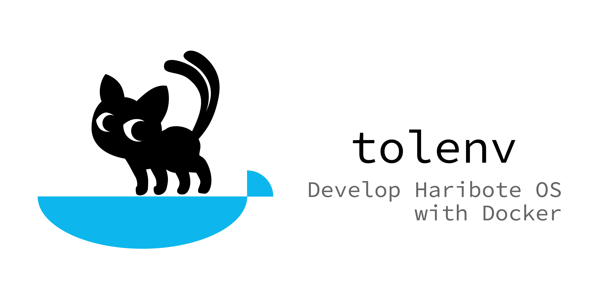

# tolenv



Dockerを使って様々な環境に対応したtolsetです。

川合秀実氏著「30日でできる！OS自作入門」の内容と、Cやアセンブリのソースレベルで互換性がありますが、Makefileは一部書き換える必要があります。書き換え方法についてはドキュメントを作成する予定です。

最終日のharib27fを、本tolenvに合わせて書き換えたものを[HariboteOS/harib27f](https://github.com/HariboteOS/harib27f)として公開していますので、こちらも参考になさってください。

## 事前準備

以下のものをインストールしておく必要があります。

- [Docker](https://www.docker.com/get-started)
- [QEMU](https://www.qemu.org)
  - エミュレーション機能が不要な場合はインストール不要です
  
## 環境チェック

以下のようにコマンドを実行した際にバージョン情報が出ていればOKです（以下の出力は検証済みの環境のもので、実際には多少異なる場合があります）。

```
$ docker --version
Docker version 19.03.5, build 633a0ea
```
## ダウンロードと展開

本リポジトリをcloneするか、zipファイルとしてダウンロードして展開します。このドキュメント(`README.md`)がある階層をプロジェクトルートとして以下は説明します。

- / プロジェクトルート
  - Makefile
  - README.md
  - harib27f/
  - z_tools/
  - z_tools_linux/
  
## Dockerイメージの取得
開発ツールを実行するために必要なDockerのイメージを取得します。この手順は、リポジトリをcloneもしくはダウンロードした後に一度だけ行えば十分です。何度実行しても害はありません。

* ターミナルを開き、プロジェクトルートへcdする
* `make pull`

実行結果のサンプルはこんな感じです。

```
$ make pull
Using default tag: latest
latest: Pulling from hikalium/ubuntu-with-libc-i386
423ae2b273f4: Already exists 
de83a2304fa1: Already exists 
f9a83bce3af0: Already exists 
b6b53be908de: Already exists 
5b278adba46d: Pull complete 
e3c3960e082b: Pull complete 
Digest: sha256:100dffd9bbf940f1ed9e413927ee12ebfa096bcec00148e94d2ac9b0cf4e0d7a
Status: Downloaded newer image for hikalium/ubuntu-with-libc-i386:latest
docker.io/hikalium/ubuntu-with-libc-i386:latest
```

すでにimageのpullが完了していれば以下のような出力が得られます。

```
$ make pull
Using default tag: latest
latest: Pulling from hikalium/ubuntu-with-libc-i386
Digest: sha256:100dffd9bbf940f1ed9e413927ee12ebfa096bcec00148e94d2ac9b0cf4e0d7a
Status: Image is up to date for hikalium/ubuntu-with-libc-i386:latest
docker.io/hikalium/ubuntu-with-libc-i386:latest
```

## 開発環境の立ち上げ

この手順は、初回だけでなく、`make down`したり、コンピューターを再起動した場合は毎回行う必要があります。（ビルドに使うdockerのコンテナを起動します。）

* ターミナルを開き、プロジェクトルートへcdする
* `make up`

実行結果のサンプルはこんな感じです。

```
$ make up
b4d30d8e4c788a2f046eadf5417eec607f130504f4da512b3cc12dc5e068a869
OK!
```

すでにupしていた場合は以下のような応答が返ってきます。

```
$ make up
Already up
```

## 開発

'z_tools/'と同じ階層にはりぼてOSのフォルダ(ex: `harib27f`)を作成して、そこで通常通り開発してください。川合秀実氏著「30日でできる！OS自作入門」の本で解説されている内容と、Cやアセンブリのソースレベルで互換性がありますが、Makefileは一部書き換える必要があります。書き換え方法についてはドキュメントを作成する予定です。

## 開発環境の終了

作業が終わってdockerのコンテナを止めたい場合は以下の手順を実行します。

* ターミナルを開き、プロジェクトルートへcdする
* `make down`

実行結果のサンプルはこんな感じです。

```
$ make down
tolenv
tolenv
tolenv container deleted
```

すでにdownしていた場合は以下のような応答が返ってきます。

```
$ make down
Error response from daemon: No such container: tolenv
Already down
```

# 謝辞
プロジェクトのアイコンについては、hideyosiさんの[KaOS素材集](http://osask.hideyosi.com/kaos/kaos.html)よりダウンロードしたものを、KL-01ライセンスの下、改変して使用しています。

# ライセンス
MIT License
